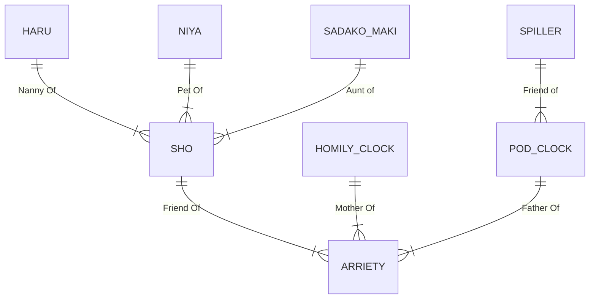

# app-dev
My first repository

## My favorite movie right now is...

# Arriety 
There's a rising trend in cozy media during the Pandemic and the movie delivers this coziness with it's magical take on the mundane. The story is about small people that borrow from humans for their sustenance. They must do this without being seen by them for fear of danger but Arriety is seen one by accident. 

> Arriety you're a part of me now. I'll never forget you ever. 

## My favorite things from the movie 

1. **Arriety's family house**

I've always known in the back of my mind that I'll have my future house be decorated in a specific shade of green and when I watched Arriety, voila! It's like a house straight out of my fantasies! 

I've never been a fan of boring and minimalistic houses so this one is full of patterns and interesting clutter :sparkling_heart:

 

2. **Ghibli landscape art**

Ghibli movies are just known for wonderful art. There's a popular challenge for painters in social media where they would paint scenes from ghibli movies. I am interested in painting and scenes from ghibli movies always inspire me. They are just colorful and vibrant which makes me happy. I have tried my hand painting this particular scene from *When Marnie was there*.

## Main Characters in the Movie

That is all for my favorite movie. Thank you for reading this far and have a great day! 

